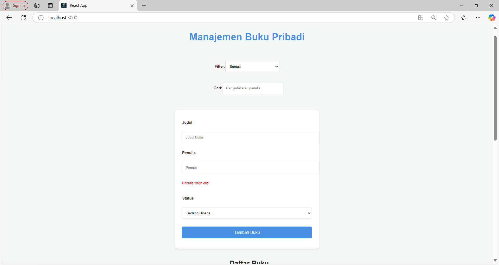
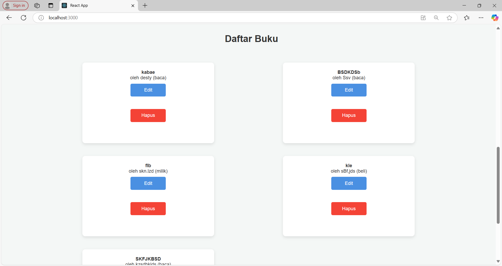
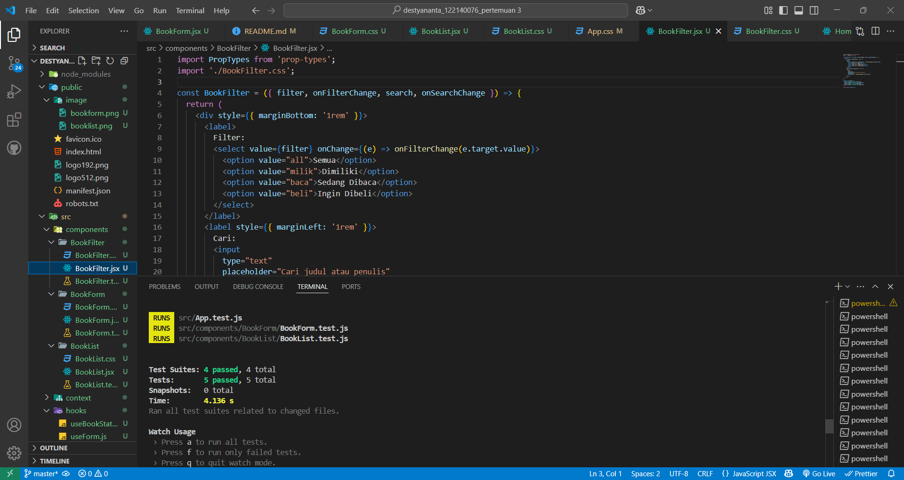

Manajemen Buku Pribadi
Aplikasi Manajemen Buku Pribadi merupakan aplikasi berbasis web yang memungkinkan pengguna untuk mengelola koleksi buku pribadi mereka. Fitur-fitur utama termasuk menambah, mengedit, dan menghapus buku, serta memfilter dan mencari buku berdasarkan statusnya (Dimiliki, Sedang Dibaca, Ingin Dibeli). Aplikasi ini dibangun menggunakan React, Context API untuk manajemen state, dan localStorage untuk penyimpanan data buku.

Deskripsi Aplikasi
Aplikasi ini dirancang untuk mempermudah pengelolaan koleksi buku pribadi. Pengguna dapat:

1. Menambah buku baru dengan mengisi informasi judul, penulis, dan status buku.
2. Mengedit dan menghapus buku yang sudah terdaftar.
3. Memfilter buku berdasarkan status (Dimiliki, Sedang Dibaca, Ingin Dibeli).
4. Mencari buku berdasarkan judul atau penulis.
5. Semua data disimpan secara lokal menggunakan localStorage.

Instruksi Instalasi dan Menjalankan Aplikasi
Untuk menjalankan aplikasi ini, ikuti langkah-langkah di bawah ini:

1. Clone repository ini
   bash
   Copy code
   git clone https://github.com/username/manajemen-buku-pribadi.git
   cd manajemen-buku-pribadi
2. Install dependencies
   Gunakan npm atau pnpm untuk menginstal dependensi.
   bash
   Copy code
   npm install

# atau jika menggunakan pnpm

pnpm install 3. Menjalankan aplikasi
Jalankan aplikasi dengan perintah berikut:
bash
Copy code
npm start

# atau jika menggunakan pnpm

pnpm start
Aplikasi akan terbuka di http://localhost:3000 di browser Anda.

### Screenshot Antarmuka

### Tampilan Form Tambah Buku

### Tampilan Daftar Buku

### Laporan testing (screenshots hasil test)

